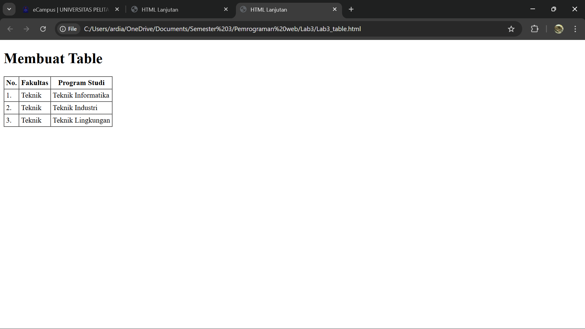
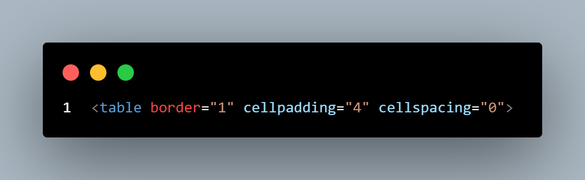

# Pratikum 2 - CSS Dasar
### NAMA : Raihan Ardiansyah
### NIM : 312410396
### KELAS : TI.24.A3

## 📍LANGKAH - LANGKAH PENGERJAAN

### 1. PERSIAPAN MEMBUAT DOKUMEN HTML DENGAN NAMA FILE lab3_list.html SEPERTI BERIKUT.

**MEMBUAT ORDERED LIST**

#### Kemudian tambahkan kode untuk membuat Ordered List seperti berikut.

**SCREENSHOOT BROWSER**

**MEMBUAT UNORDERD LIST**

### Kemudian tambakan kode untuk membuat Unordered List, setelah deklarasi ordered list pada section unordered-list, seperti berikut.

 

**MEMBUAT DESCRIPTION LIST**

#### Kemudian tambahkan kode untuk membuat description list setelah deklarasi unorderd-list.
 

 

## 2. MEMBUAT TABLE

#### Buat file baru dengan nama lab3_tabel.html seperti berikut.

#### Kemudian selanjutnya tambahkan kode untuk membuat tabel sederhana seperti berikut:

 

** MENGATUR MARGIN DAN PADDING

 

**MENGGABUNGKAN SEL DATA**

#### Untuk menggabungkan sel data, gunakan atribut rowspan dan colspan. Atribut rowspan untuk menggabungkan baris (secara vertikal) dan colspan untuk menggabungkan kolom (secara horizontal).

 

## 3. MEMBUAT FORM

#### Buat file baru dengan nama lab3_form.html seperti berikut.

#### Kemudian selanjutnya tambahkan kode untuk membuat tabel sederhana seperti berikut:

 

**MENAMBAHKAN STYLE PADA FORM**

#### Agar tampilan form lebih menarik, bisa ditambahkan CSS seperti berikut.

 

